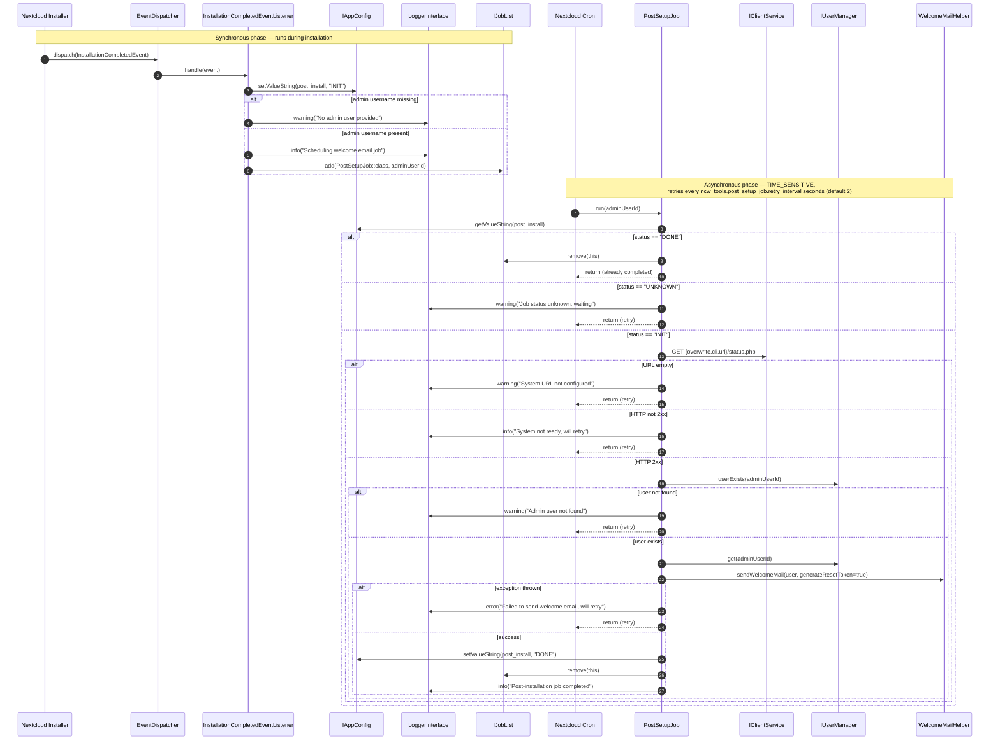

# Post-setup welcome mail

After Nextcloud installation completes, this app sends an initial welcome email to the admin user. A listener seeds an app-config status flag and schedules a time-sensitive background job; the job retries on a configurable interval until the system URL is reachable and the admin user exists, then sends the welcome mail via Nextcloud's `NewUserMailHelper` (with a fresh password-reset token) and marks itself done.

## Trigger event

`OCP\Install\Events\InstallationCompletedEvent`

## Configuration

| Key | Where | Type | Default | Purpose |
| --- | --- | --- | --- | --- |
| `overwrite.cli.url` | `config/config.php` | string | _required_ | Base URL the job probes via `…/status.php` to confirm the instance is reachable. |
| `ncw_tools.post_setup_job.retry_interval` | `config/config.php` | int (seconds) | `2` | Interval between job retries while waiting for the system to become ready. |
| `post_install` | App config (`ncw_tools`) | string | _set by listener_ | Observable status: `INIT` (work pending), `DONE` (welcome mail sent), `UNKNOWN` (listener has not run). |

## Flow

## Failure modes

The job is `TIME_SENSITIVE` and re-runs on every cron tick until it succeeds. Any of the following keep it in the queue:

- `overwrite.cli.url` is unset.
- `…/status.php` returns a non-2xx response, or the request throws.
- The admin user does not exist (or cannot be retrieved).
- `WelcomeMailHelper::sendWelcomeMail` throws.

On success, the job sets `post_install = "DONE"` and removes itself from the job list. A subsequent install event would re-seed the status to `INIT` and re-schedule the job.
