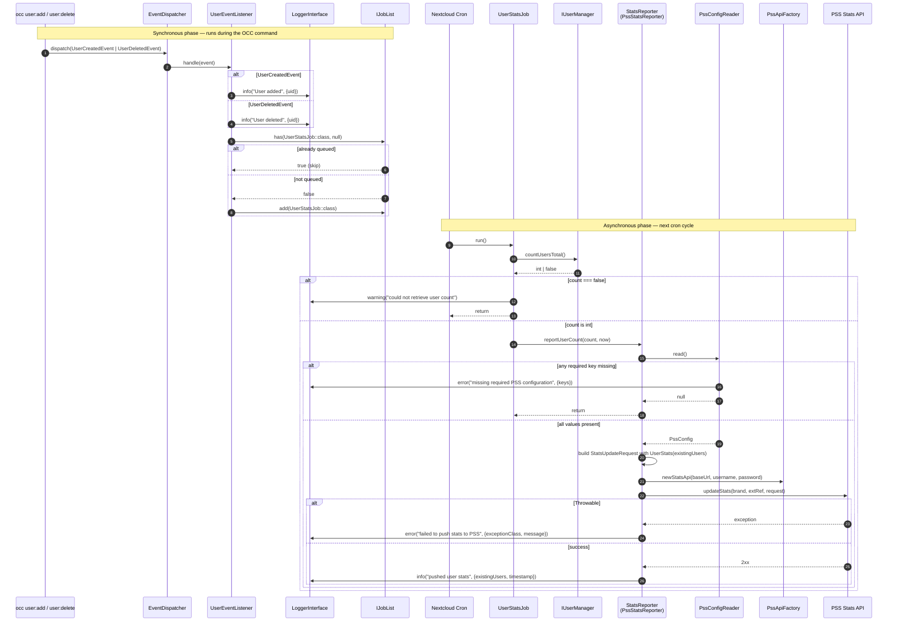

# User stats reporting

On every user create or delete, this app reports the current total user count to the PSS Stats API. A listener logs the change and enqueues a single deduplicated background job; on the next cron tick the job reads the total user count and delegates to a `StatsReporter` (the PSS adapter validates configuration, builds the `StatsUpdateRequest`, and POSTs it to the PSS Stats API). The job is queued — it does not retry on failure; the next user event re-enqueues it.

## Trigger events

- `OCP\User\Events\UserCreatedEvent`
- `OCP\User\Events\UserDeletedEvent`

## Configuration

All keys live in `config/config.php`. The adapter aborts (with a logged error listing the missing keys) if any required value is missing or empty.

### Required

| Key | Type | Purpose |
| --- | --- | --- |
| `ncw_tools.pss.brand` | string | PSS brand identifier; first path segment of the stats endpoint. |
| `ncw_tools.pss.ext_ref` | string | External tenant reference; second path segment of the stats endpoint. |
| `ncw_tools.pss.base_url` | string | Base URL of the PSS API. |
| `ncw_tools.pss.username` | string | HTTP Basic auth username. |
| `ncw_tools.pss.password` | string | HTTP Basic auth password. |

### Optional

| Key | Type | Default | Purpose |
| --- | --- | --- | --- |
| `ncw_tools.pss.connect_timeout` | int (seconds) | `5` | Guzzle connect timeout. |
| `ncw_tools.pss.timeout` | int (seconds) | `10` | Guzzle overall timeout. |
| `ncw_tools.pss.allow_insecure` | bool | `false` | When `true`, disables TLS verification (`verify => false`). **Dev/debug only** — never enable in production. |

### Security notes for `ncw_tools.pss.password`

The password is stored in `config/config.php` in plaintext, same trust model as the DB password already in that file. Two operational considerations:

- **Shell history / `ps` exposure.** `occ config:system:set` puts the value on the command line — visible in `ps` and shell history. Prefer a leading-space command (with `HISTCONTROL=ignorespace` set) or read the value from an env var so it does not appear in process listings.
- **File permissions.** `config/config.php` should be `0640 root:www-data`. Audit on deploy.

Code-side, the `PssConfig` DTO redacts `password` via `__debugInfo()`, and the PSS error handler logs `exceptionClass + message` only (not the full trace), so accidental serialization or deep-vendor stack-traces will not leak the value.

## Flow

## Failure modes

The job is a `QueuedJob` — there is no automatic retry. Each of the following ends the run without reporting:

- `IUserManager::countUsersTotal()` returns `false` (logged at warning by the job).
- Any of the five required `ncw_tools.pss.*` values is missing or empty (logged at error by `PssConfigReader`, naming the missing keys).
- The PSS API call throws (logged at error by `PssStatsReporter` with `exceptionClass` + `message`).

The next `UserCreatedEvent` or `UserDeletedEvent` re-enqueues the job, so the count converges once the underlying problem is resolved.
