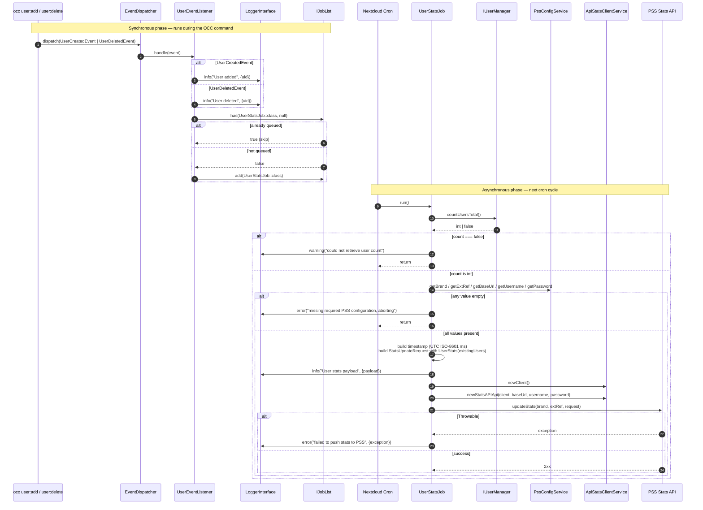

# User stats reporting

On every user create or delete, this app reports the current total user count to the PSS Stats API. A listener logs the change and enqueues a single deduplicated background job; on the next cron tick the job reads the total user count, validates the PSS credentials, and POSTs a `StatsUpdateRequest` to the PSS Stats API. The job is queued — it does not retry on failure; the next user event re-enqueues it.

## Trigger events

- `OCP\User\Events\UserCreatedEvent`
- `OCP\User\Events\UserDeletedEvent`

## Configuration

All keys live in `config/config.php`. The job aborts (with a logged error) if any value is missing or empty.

| Key | Type | Purpose |
| --- | --- | --- |
| `ncw_tools.pss.brand` | string | PSS brand identifier; first path segment of the stats endpoint. |
| `ncw_tools.pss.ext_ref` | string | External tenant reference; second path segment of the stats endpoint. |
| `ncw_tools.pss.base_url` | string | Base URL of the PSS API. |
| `ncw_tools.pss.username` | string | HTTP Basic auth username. |
| `ncw_tools.pss.password` | string | HTTP Basic auth password. |

## Flow

## Failure modes

The job is a `QueuedJob` — there is no automatic retry. Each of the following ends the run without reporting:

- `IUserManager::countUsersTotal()` returns `false` (logged at warning).
- Any of the five `ncw_tools.pss.*` values is missing or empty (logged at error).
- The PSS API call throws (logged at error with the exception).

The next `UserCreatedEvent` or `UserDeletedEvent` re-enqueues the job, so the count converges once the underlying problem is resolved.
