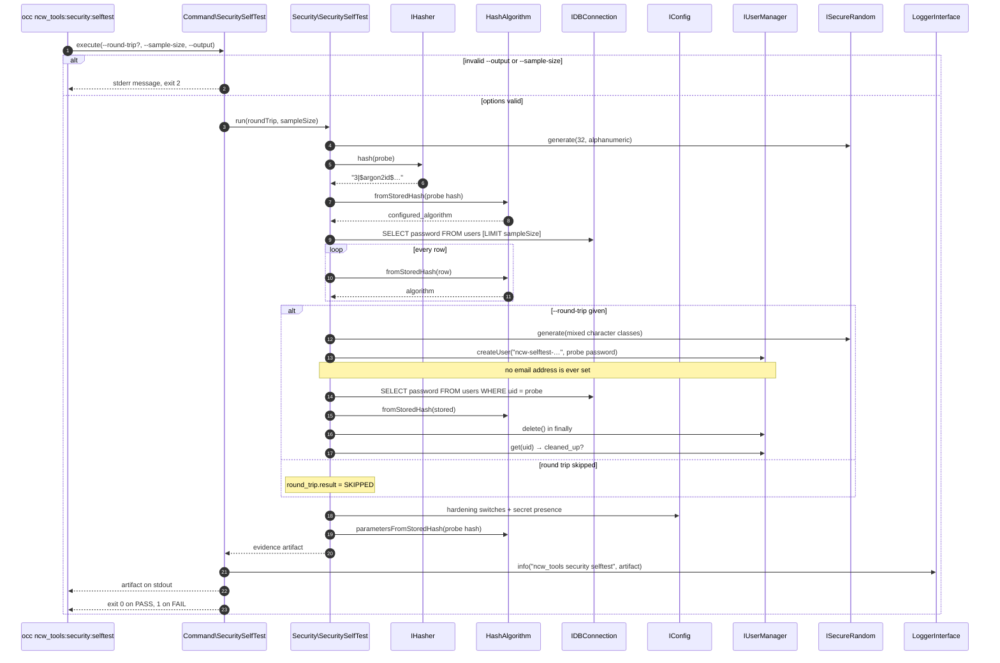

# Security self-test

`occ ncw_tools:security:selftest` verifies that this instance hashes passwords with **argon2id** and that the surrounding hardening switches are in place, then emits a structured evidence artifact for C5 control **PSS-07**. The command is the evidence producer: a deployment wrapper runs it, pipes the artifact into `jq`, and archives the result. The same artifact is written to the log as structured context so it also lands in Kibana.

## Usage

```
occ ncw_tools:security:selftest [--round-trip] [--sample-size=N] [--output=plain|json|json_pretty]
```

| Option | Default | Purpose |
| --- | --- | --- |
| `--round-trip` | off | Create a disposable probe user, read back the algorithm that actually landed in `oc_users.password`, then delete it again. This is the only check that observes the *whole* write path rather than a hasher probe. |
| `--sample-size=N` | `1000` | Number of rows to survey in the stored hash distribution. `0` surveys all rows. |
| `--output` | `plain` | `json` and `json_pretty` emit the evidence artifact; `plain` renders it for humans. |

| Exit code | Meaning |
| --- | --- |
| `0` | PASS — every executed check passed. |
| `1` | FAIL — at least one executed check failed. The complete artifact is still written to stdout. |
| `2` | Usage error (unknown `--output` format, invalid `--sample-size`). No artifact is written. |

**stdout carries nothing but the artifact.** Diagnostics, warnings and the log line go to stderr, so `occ ncw_tools:security:selftest --output=json | jq` is safe. On a FAIL the artifact is written in full *before* the non-zero exit — the failure case is precisely what the evidence needs to capture.

## Why a stored hash is not simply matched against `$argon2id$`

Nextcloud does not store a bare `password_hash()` string. `OC\Security\Hasher::hash()` prepends a hasher version and a pipe:

```
3|$argon2id$v=19$m=65536,t=4,p=1$<salt>$<hash>
```

Version `3` is argon2id, `2` is argon2i, `1` is bcrypt. Hashes written before the version prefix existed are stored unprefixed — a 60 character bcrypt string or a 40 character sha1 hex digest. A check that compares the stored value against the literal prefix `$argon2id$` therefore never matches, no matter how the instance is configured. `OCA\NcwTools\Security\HashAlgorithm` splits the version prefix off first (mirroring the private `Hasher::splitHash()`) and then classifies the remainder by its algorithm marker — `$argon2id$`, `$argon2i$`, or a 60 character `$2…` for bcrypt.

Classifying by marker rather than by `password_get_info()` is deliberate. PHP registers the argon2 handlers only when it was built with argon2 support — the same `HAVE_ARGON2LIB || HAVE_LIBSODIUM` condition that defines `PASSWORD_ARGON2ID` — so on a build without it `password_get_info()` reports `unknown` for a perfectly good `$argon2id$` hash. That is exactly the build this self-test exists to catch (see [Failure modes](#failure-modes)), and it is the build on which `stored_distribution` has to stay truthful: those rows really are argon2id, and reporting them as `unknown` would blur the finding instead of sharpening it.

## The evidence artifact

The shape is a cross-repo contract — `nc-manager/bin/send-report.sh` reads it with `jq` — so it is published as a JSON Schema next to this page: [`security-selftest.schema.json`](security-selftest.schema.json) (draft 2020-12). Both test suites validate real artifacts against it, so the schema cannot drift from the producer, and a consumer can validate an artifact it receives with any standard tool. Changing the shape means bumping `schema_version`.

Beyond field types, the schema encodes the verdict invariants: a top-level `PASS` requires both sections to pass, a passing `password_hashing` requires `argon2id` and no surveyed row outside the tolerated buckets, and a `round_trip` that is `SKIPPED` must report nothing while one that passed must show `argon2id` and `cleaned_up: true`.

```json
{
  "schema_version": "3",
  "timestamp": "2026-09-01T12:00:00Z",
  "result": "PASS",
  "instance": { "id": "ocb0ycrd5a7h", "url": "https://cloud.example.com", "name": "", "namespace": "", "environment": "" },
  "password_hashing": {
    "result": "PASS",
    "configured_algorithm": "argon2id",
    "round_trip": { "result": "SKIPPED", "stored_algorithm": null, "cleaned_up": null },
    "stored_distribution": { "argon2id": 1, "bcrypt": 0, "empty": 0, "unknown": 0 }
  },
  "security_config": {
    "result": "PASS",
    "checks": [ { "key": "hashing_default_password", "expected": false, "actual": false, "result": "PASS" } ],
    "parameters": { "memory_cost": 65536, "time_cost": 4, "threads": 1 }
  }
}
```

### Security invariant

**No field ever carries hash material, a salt or a secret value.** Only algorithm names, counts, booleans and cost parameters are reported. `passwordsalt` and `secret` are reported as presence (`true`/`false`) under the keys `passwordsalt_present` and `secret_present` — never as values. Both the unit and the integration suite assert this by encoding the artifact and searching it for the real stored hashes and config secrets.

### Fields

| Field | Meaning |
| --- | --- |
| `schema_version` | Artifact schema version. Currently `"3"` (a string). |
| `timestamp` | Collection time, UTC, `YYYY-MM-DDTHH:MM:SSZ`. |
| `result` | `PASS` only when both `password_hashing.result` and `security_config.result` are `PASS`. |
| `instance.id` | `instanceid` from `IConfig`. |
| `instance.url` | `overwrite.cli.url` from `IConfig`. Used downstream as the fallback identifier. |
| `instance.name` / `namespace` / `environment` | From the environment variables `INSTANCE_NAME`, `NAMESPACE`, `ENVIRONMENT`; empty string when unset. |
| `password_hashing.configured_algorithm` | The algorithm a *new* password gets, determined by hashing a random probe through `IHasher` and classifying the result. Must be `argon2id`. |
| `password_hashing.round_trip` | See below. `SKIPPED` unless `--round-trip` is given, and a skipped round trip never affects the result. |
| `password_hashing.stored_distribution` | Row counts per algorithm over the surveyed rows of the `users` table. |
| `security_config.checks` | One entry per asserted config value: `key`, `expected`, `actual`, `result`. |
| `security_config.parameters` | Evidence, not an assertion: the cost parameters the probe hash was actually produced with, as reported by `password_get_info()`. `memory_cost`/`time_cost`/`threads` for argon2, `cost` for bcrypt. These are the *effective* values — stronger evidence than the `hashing*` config keys, which the hasher clamps to the algorithm minimums. Always a JSON object, empty (`{}`) when the parameters cannot be read — notably for an argon2 hash on a build without argon2 support, since only the registered handler can read the cost fields. |

### `stored_distribution`

The four buckets `argon2id`, `bcrypt`, `empty` and `unknown` are always present, in that order. `argon2i`, `legacy-bcrypt` and `legacy-sha1` are added only when rows of that kind are actually observed, so their presence in an artifact is itself the finding. Consumers should read named keys (or sum `to_entries`) rather than assume a fixed key set.

The survey passes when every counted row is `argon2id` or `empty`. Rows with no local password at all (SSO-only accounts) are not a hashing downgrade and are tolerated; anything else — `bcrypt`, `argon2i`, either legacy form, or `unknown` — fails the survey, because it means either a legacy account that has never re-authenticated or a configuration that has been downgraded.

### `round_trip`

| Field | Meaning |
| --- | --- |
| `result` | `SKIPPED` without `--round-trip`. Otherwise `PASS` when `stored_algorithm` is `argon2id` **and** `cleaned_up` is `true`. |
| `stored_algorithm` | The algorithm classified from the row the probe user actually wrote, or `null` when the probe could not be created. |
| `cleaned_up` | Re-checked after deletion by resolving the uid again; `true` means the probe user is gone. |

The probe user is created as `ncw-selftest-<random>` with a password assembled from all four character classes (so the always-enabled `password_policy` app accepts it) and **never** gets an email address, so it cannot receive mail or a password reset link. Deletion happens in a `finally`, and a probe user that survives is both logged at error level and reported as a failure. The reason a round trip failed is never in the artifact (the schema is fixed) — look for the `SecuritySelfTest: round-trip …` error lines in the log.

Creating and deleting the probe user dispatches `UserCreatedEvent` and `UserDeletedEvent`, which this app's own `UserEventListener` reacts to by enqueuing a (deduplicated) `UserStatsJob`. Running the round trip therefore causes one extra user-count report on the next cron tick.

### `security_config.checks`

| `key` | Expected | Why |
| --- | --- | --- |
| `hashing_default_password` | `false` | The real downgrade switch. `Hasher::getPrefferedAlgorithm()` returns `PASSWORD_DEFAULT` — bcrypt today — as soon as this is `true`, so every new password stops being argon2id. |
| `auth.bruteforce.protection.enabled` | `true` | Brute-force throttling on authentication endpoints. |
| `ratelimit.protection.enabled` | `true` | Rate limiting on annotated controllers. |
| `overwriteprotocol` | `https` | Credentials must never be submitted over plain http. |
| `passwordsalt_present` | `true` | Presence of `passwordsalt`; needed to verify legacy hashes. Value never reported. |
| `secret_present` | `true` | Presence of `secret`. Value never reported. |

All values are read through `IConfig`, so the **effective merged** configuration is asserted — `config/config.php` plus every `config/*.config.php` overlay — not a single file.

## Log line and Kibana

The command logs exactly one line at info level with the artifact as structured context:

- message: `ncw_tools security selftest`
- app: `ncw_tools`

The deployment sets `log_type=errorlog`, so the log JSON is written to stderr and picked up by the platform's log shipper.

```
app: "ncw_tools" AND message: "ncw_tools security selftest"
```

Narrow to failures:

```
app: "ncw_tools" AND message: "ncw_tools security selftest" AND data.result: "FAIL"
```

The round-trip diagnostics use the same app and are matched with:

```
app: "ncw_tools" AND message: "SecuritySelfTest: *"
```

**Caveat on nested fields.** Nextcloud's log writer serialises nested context arrays into JSON *strings*. The top-level scalars stay directly queryable — `data.schema_version`, `data.timestamp`, `data.result` — but `data.instance`, `data.password_hashing` and `data.security_config` arrive as strings containing JSON and need a parse (a Logstash/ingest `json` filter, or `| fromjson` at query time) before their inner fields can be filtered on. Use the stdout artifact, not the log line, when a consumer needs the nested fields structured.

## Flow



## Failure modes

| Symptom | Interpretation |
| --- | --- |
| `configured_algorithm` is `bcrypt` and `hashing_default_password` fails | The downgrade switch is on. Every password set from now on is bcrypt. |
| `configured_algorithm` is `bcrypt` but `hashing_default_password` passes | The PHP build has no argon2 support (`PASSWORD_ARGON2ID` undefined). An image problem, not a config problem. `stored_distribution` still reports the existing rows as `argon2id`, and `security_config.parameters` comes back empty — so the artifact shows argon2id at rest against a build that can no longer produce or verify it. Note that no existing account can authenticate on such a build. |
| `configured_algorithm` is `argon2id` but `round_trip.stored_algorithm` is not | Something between `IUserManager` and the database is rewriting the hash — a user backend that hashes on its own, for example. |
| `stored_distribution` shows `bcrypt`, `argon2i` or a `legacy-*` bucket | Accounts that have not authenticated since the algorithm changed. Nextcloud rehashes on the next successful login; a persistent count means those accounts are dormant. |
| `round_trip.cleaned_up` is `false` | A probe account was left behind. Delete `ncw-selftest-*` manually and investigate the logged error. |
| `round_trip.result` is `FAIL` with `stored_algorithm: null` | The probe user could not be created — most likely `password_policy` rejected the generated password. See the logged error. |
| Exit 2 with no artifact | Wrong invocation, not a control failure. |
